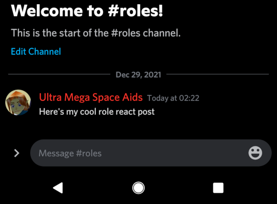
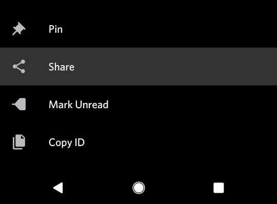
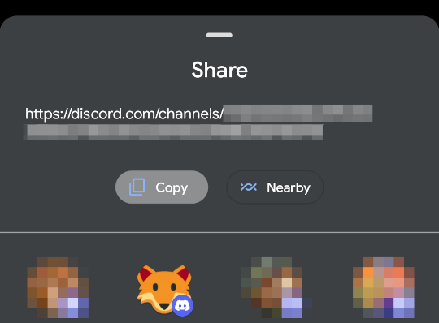
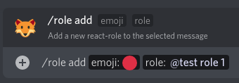

# Overview
A Discord bot that can assign roles based on message reactions.<br/>
[You can invite my live instance of the bot to your server with this link](
https://discord.com/oauth2/authorize?client_id=692585944934514738&scope=bot&permissions=335881280
).

# Why this bot?
Several other popular role-react bots exist, but many of them have some annoying
catch. Some have uptime issues, some lock basic functionality behind premium pay
walls, and some come with way too many other features that add bloat, requiring
convoluted web APIs for configuration. In most cases the source code also isn't
available, so we can't do anything about it.

This bot attempts to address these issues. It _only_ does role reacts, and is
configured using slash commands. Every feature of this bot is completely free to
use, and always will be. It's also open source, so you can modify it to better
suit your needs, or just download it and host your own instance.

Basically, there's no bullshit.

# Usage
You can interact with the bot using slash commands.

The bot will always respond to users with the "Administrator" permission.
Additional roles can be whitelisted to modify the bot config for your guild.

You write the post people can react to for their roles. The bot will not attempt
to write its own posts for this (but will add its own emojis).

## Permissions
The role automatically created for the bot needs to be ordered above any role
you want the bot to be able to assign. That role also needs to have access to
the channel with your role-react post, and have have following permissions:
* **Add Reactions** - To add the initial react to the post
* **Manage Messages** - To remove all reacts from a post
* **Manage roles** - To assign roles to users
* **Read Message History** - To see posts in the channel before it joined
* **Use External Emojis** - To use your custom emojis in role reacts
* **Read Text Channels & See Voice Channels** - To see the role-react post

**Note:** These permissions may be inherited from your `@everyone` settings.

## Selecting a Message
You need to select a message to add react roles to it. Right click on a message
and use Discord's fancy context menu to select it. This is tracked per-user, so
multiple users can interact with the bot at the same time.

Due to current Discord limitations, context menus are not available on mobile
devices (sorry). See below for alternative.


## Selecting a Message on Mobile
If you are on mobile, you might not have access to context menus. Don't worry,
there's a workaround for you. Long-press the message, select
"Copy Message Link", then use `/select-message-mobile` with the message URL
instead.

| This is the Message       | Long press and Share      | Tap Copy                  |
|---------------------------|---------------------------|---------------------------|
||||


## Adding a Role to the Message
Use the `/role add` slash command to add a role to the message.



You can also remove a role from the message using `/role remove`, or remove
all roles from the message using `/role remove-all`. This will remove all
reactions from the post, but **will not** unassign any roles.

## Making Two Roles Mutually Exclusive
Use the `/mutex add` slash command to make two (or more) roles mutually
exclusive. If a user tries to add two roles that are mutually exclusive, the bot
will automatically remove the first one they had. You can have multiple mutually
exclusive groups.

This setting is **server-wide**. If roles A, B, and C are all mutually
exclusive, when a user with roles B and C tries to assign role A, the bot will
automatically remove roles B and C from them **even if those roles were not
assigned by the bot in the first place**.

Due to current Discord limitations, you can only add two roles per-command, so
you'll need to run the command several times to make more than two roles
mutually exclusive (once again, sorry).


Use `/mutex remove` to remove to mutually exclusive restriction on two roles.

## Adding Roles That Can Configure The Bot
By default, the bot will only listen to users who have the "Administrator"
permission. You can use `/permission add` to add additional roles that are
allowed to configure the bot in your guild.


Use `/permission remove` to disallow a role from configuring the bot.<br/>
**Note:** A user can remove their own permission to configure the bot if they
are not an administrator!

## Printing Bot Info
You can use `/info` to print the bot's description, version number, link to the
source code, and some fun stats. This command is available to all users and
posts **non-ephemeral** replies (i.e. visible to everybody).


## Rate Limits
If the bot is taking a few moments to respond to reactions, it is likely hitting
Discord's strict rate limit. This happens most often with mutually exclusive
roles, since the bot needs to make several requests to make them work. The bot
is registering the actions. Give it a few seconds to catch up.

## @everyone
Discord implements `@everyone` as a role under the hood. This means you can set
up react roles for `@everyone` like you would for any other role. It's silly, it
won't do anything, but you *could* do it...

## Hosting your own instance
This bot is built on [discord.js](https://discord.js.org/#/) v13, so you'll need
Node.js 16.6.0 (or newer) installed. You will also need your own Discord bot
account.

If you're upgrading from an older Discord.js v12 version of the bot, the Node.js
16.6.0 requirement might be problematic. you might consider using something like
https://github.com/nvm-sh/nvm to make the transition easier.

The `resources` directory has a service file that can be used with Linux distros
with systemd. If you're installing this on some other operating system, you're
on your own.

### Running as a service
The provided service file expects to find the bot code at
`/srv/discord/ReactionRoleBot/`, and will want to create the sqlite database at
`/srv/discord/rolebot.sqlite`. The easiest way to do this is to create a
`/srv/discord` directory, and `chown` it so it belongs to the user running the
bot.

The following will prepare the bot to run. Run this from `/srv/discord`:
```
git clone https://github.com/Mimickal/ReactionRoleBot.git
cd ReactionRoleBot
npm install
NODE_ENV=prod npm run knex migrate:latest
```

Create a file `/etc/discord/ReactionRoleBot/config.json` and paste in the
following (obviously fill in the blanks with your bot's info):
```json
{
  "token": "<your token here>",
  "app_id": "<your bot application ID here>"
}
```

Install `reactionrolebot.service` into `/etc/systemd/system/`.

Now you should be able to run `systemctl restart reactionrolebot.service` to
start your bot.

### Running locally (in dev-mode)
Run this wherever you want:
```
git clone https://github.com/Mimickal/ReactionRoleBot.git
cd ReactionRoleBot
npm install
npm run knex migrate:latest
```

Create a file containing your bot token in plain text.

Run this to start the bot: `node main.js path/to/your/config`
